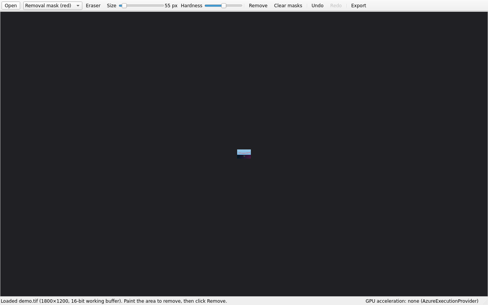

# ObjectRemover

Local Windows tool for removing objects from large images. Paint over what
should go away, optionally paint "protect" areas the fill must respect, hit
Remove, and export the result. Everything runs locally on your NVIDIA GPU.

Supported inputs: **TIFF, JPG** (large, up to ~100 MP). Exports: **JPG** (sRGB,
quality slider) and **16-bit TIFF**, metadata preserved.



See [REQUIREMENTS.md](REQUIREMENTS.md) for the approved spec and
[ARCHITECTURE.md](ARCHITECTURE.md) for the design.

## Install (Windows, target machine)

```bat
py -3.11 -m venv .venv
.venv\Scripts\activate
pip install -r requirements-gpu.txt
pip install -e . --no-deps
python -m object_remover
```

`requirements-gpu.txt` installs `onnxruntime-gpu` (CUDA). If you only want the
CPU/classical engine for a smoke test, use `requirements-cpu.txt` instead.
Optional: `pip install pynvml` to show free VRAM in the status bar.

On **first launch** the app offers to download the LaMa AI model (~208 MB) into
`%LOCALAPPDATA%\ObjectRemover\models`. After that, everything is fully offline.
Until the model is present the app still works with a classical inpainting
fallback (noticeably lower quality).

## Develop / test (any OS)

```bash
python3.11 -m venv .venv
source .venv/bin/activate          # Windows: .venv\Scripts\activate
pip install -r requirements-cpu.txt
pip install -e . --no-deps
pip install pytest onnx            # onnx only needed for engine contract tests
pytest                             # core tests run headless
QT_QPA_PLATFORM=offscreen pytest tests/test_gui_smoke.py   # GUI smoke test
python -m object_remover           # run the app
```

## Usage

1. **Open** a TIFF or JPG.
2. Paint the **removal mask** (red). Switch to the **protect mask** (green) to
   paint areas the fill must not touch or copy from.
3. Both masks support paint/erase, brush size (`[` / `]`) and hardness; every
   stroke is undoable (`Ctrl+Z` / `Ctrl+Y`).
4. Click **Remove**. If the masks overlap you are asked which one wins.
5. Repeat for as many areas as you like, then **Export** as JPG or 16-bit TIFF.

## Build a Windows installer

```bat
pip install pyinstaller
pyinstaller packaging\object_remover.spec
iscc packaging\installer.iss
```

## Notes

- Inference runs in native-resolution 512×512 windows (LaMa ONNX fixed input),
  with 128 px overlap and feathered blending — no detail loss on huge images.
- Protected pixels are never overwritten and never used as fill source.
- Export never modifies the source image.

## Diagnostics (opt-in)

Capture is off by default. To record each fill stage of a removal run,
create an empty file named `diagnostics.enabled` in
`%LOCALAPPDATA%\ObjectRemover` (the same app-data folder as `quality.ini`).
While that marker exists, every removal writes a uniquely named folder under
`%LOCALAPPDATA%\ObjectRemover\diagnostics\` containing `00-original.png`
(cropped region), `mask.png` (effective removal mask), `01-native.png`,
`02-context.png` (only when the context pass ran),
`03-combined-before-corrections.png`, `04-final.png`, and `metadata.json`
(engine, quality settings, crop coordinates, context-pass info).

Everything is written locally — no upload or network activity. The
diagnostic images are 8-bit PNGs and **may not preserve the
ICC/color-management appearance** of the original; compare structure and
relative color between stages rather than against the exported file. Any
write error is logged and never affects the removal result. Delete the
marker file to turn capture off.
